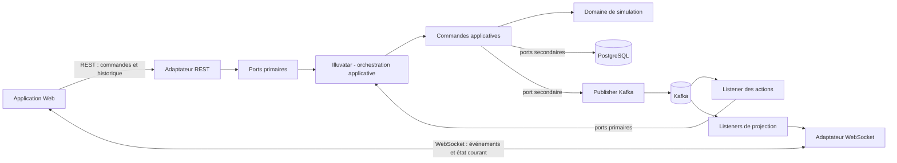
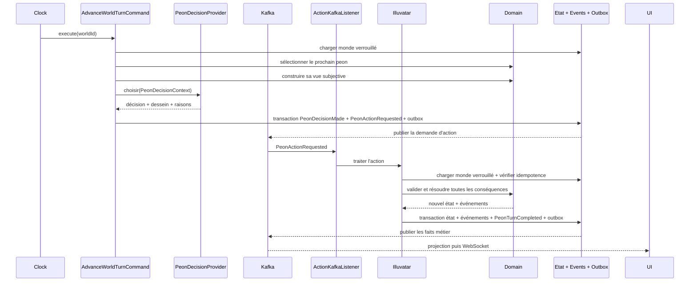

# Architecture du simulateur de peons

## 1. Objectifs et principes

Le système simule un monde hexagonal au tour par tour dans lequel une ou plusieurs équipes de peons évoluent. Pour un peon, un tour correspond à une décision principale parmi :

- `VOIR`
- `MANGER`
- `SE_DEPLACER`
- `ATTAQUER`
- `COMMUNIQUER`
- `NE_RIEN_FAIRE`

Une décision peut toutefois être composée de plusieurs effets métier liés. En particulier, `SE_DEPLACER` inclut automatiquement une observation `VOIR` depuis la case d'arrivée. Le déplacement et cette observation consomment ensemble un seul tour du peon.

Le backend Java/Spring Boot contient un orchestrateur central nommé `Illuvatar`. Kafka transporte les actions demandées et les événements produits par leur résolution. L'interface Web affiche l'état courant et permet de relire l'historique avec un curseur temporel et un bouton de lecture.

Principes structurants :

- architecture hexagonale : le domaine ne dépend ni de Spring, ni de Kafka, ni de la base de données ;
- simulation déterministe : même configuration, même graine aléatoire et mêmes décisions produisent le même résultat ;
- un seul orchestrateur logique par monde afin de garantir l'ordre des tours ;
- événements immuables et versionnés ;
- l'historique est reconstruit à partir d'événements et accéléré par des snapshots ;
- Kafka diffuse les faits métier, mais ne remplace pas le stockage durable de consultation.

## 2. Vue d'ensemble



La boucle autorise une seule action en cours par monde. Après la décision d'un peon, une demande `PeonActionRequested` est enregistrée dans l'outbox puis publiée dans Kafka. Un listener la transmet à `Illuvatar`, qui la valide, applique toutes ses conséquences dans une transaction et publie `PeonTurnCompleted`. Le peon suivant ne joue qu'après cette confirmation. Ce protocole conserve l'ordre des tours tout en faisant réellement passer les actions par les listeners Kafka.

## 3. Découpage hexagonal

### 3.1 Domaine

Le domaine contient uniquement les règles de simulation :

- agrégats : `World`, `Peon`, `Team` ;
- objets-valeur : `WorldId`, `PeonId`, `TeamId`, `PeonFirstName`, `HexCoordinate`, `HealthPoints`, `ExperiencePoints`, `Level`, `MentalMap`, `RememberedCell`, `TurnNumber` ;
- énumérations : `TerrainType`, `ActionType`, `WorldStatus`, `PeonPurpose` (`SURVIVRE`, `GAGNER_DES_NIVEAUX`, `AIDER_LES_ALLIES`) ;
- actions métier : `SeeAction`, `EatAction`, `MoveAction`, `AttackAction`, `CommunicateAction`, `IdleAction` ;
- événements métier : `PeonDecisionMade`, `PeonSaw`, `PeonAte`, `FoodConsumed`, `PeonMoved`, `PeonAttacked`, `PeonCommunicated`, `PeonIdled`, `PeonExperienceGained`, `PeonLeveledUp`, `PeonHungerApplied`, `PeonDied`, ainsi que les événements de cycle de vie du monde ;
- événements d'orchestration : `PeonActionRequested` et `PeonTurnCompleted` ;
- services de domaine sans état, par exemple validation du déplacement, portée de vision, résolution d'un combat et génération de terrain.

Le domaine ne publie rien directement. L'exécution d'une règle retourne un résultat contenant le nouvel état et les événements métier à enregistrer.

### 3.2 Application

Les commandes applicatives orchestrent les cas d'usage et exposent toutes une méthode `execute()` :

- `CreateWorldCommand`
- `StartWorldCommand`
- `PauseWorldCommand`
- `AdvanceWorldTurnCommand`
- `SubmitPeonActionCommand`
- `ProcessPeonActionEventCommand`
- `GetWorldStateCommand`
- `GetWorldTimelineCommand`
- `ReplayWorldCommand`

Une commande peut appeler plusieurs services de domaine et plusieurs ports, mais aucune commande n'appelle une autre commande. Les services de domaine ne dépendent ni des commandes ni d'autres services.

#### Illuvatar

`Illuvatar` est le nom du sous-système d'orchestration applicative et son unique point d'entrée logique. Ce n'est ni un agrégat du domaine, ni un listener Kafka, ni une classe autorisée à modifier directement les champs des entités. Les adaptateurs REST, scheduler et Kafka le pilotent à travers des ports primaires ; ses commandes appellent les comportements du domaine et les ports secondaires nécessaires.

Ses responsabilités sont :

- créer le monde, le terrain, les équipes, les peons, leurs positions initiales et la nourriture ;
- initialiser les prénoms, PV, XP, niveaux, cartes mentales et paramètres de simulation ;
- sélectionner le prochain peon vivant et lui faire produire sa propre décision subjective ;
- publier la demande d'action dans Kafka et attendre sa résolution avant de poursuivre le monde ;
- recevoir les actions depuis les listeners et garantir leur traitement dans l'ordre du monde ;
- demander au domaine d'appliquer le déplacement, la vision, le repas, l'attaque, la communication ou l'inaction ;
- orchestrer les conséquences : nourriture consommée, PV gagnés ou perdus, faim, XP, changement de niveau et décès ;
- retirer un peon mort des occupants de sa case et signaler son décès au monde ;
- faire disparaître la nourriture lorsque sa quantité atteint zéro ;
- persister l'état, le journal d'événements et l'outbox dans une même transaction ;
- publier la fin du tour afin d'autoriser le peon suivant.

Les invariants restent dans le domaine : `Illuvatar` ne calcule pas lui-même les dégâts, les niveaux ou la visibilité. Il orchestre les règles correspondantes et applique leur résultat. Cette séparation empêche l'orchestrateur de devenir un objet omniscient impossible à tester.

Ports primaires proposés :

- `WorldAdministrationUseCase`
- `SimulationUseCase`
- `WorldQueryUseCase`
- `ActionEventIngestionUseCase`

Ports secondaires proposés :

- `WorldRepository`
- `WorldEventRepository`
- `WorldSnapshotRepository`
- `ActionRequestPublisher`
- `DomainEventPublisher`
- `SimulationClock`
- `PeonDecisionProvider`
- `PeonFirstNameCatalog`
- `RandomSource`

### 3.3 Adaptateurs primaires

- REST : création/configuration d'un monde, démarrage, pause, avance manuelle, lecture d'un état historique ;
- WebSocket/SSE : diffusion temps réel vers le navigateur ;
- Kafka action listener : transmet les `PeonActionRequested` à `Illuvatar` via `ActionEventIngestionUseCase` ;
- Kafka projection listeners : consomment les faits métier pour l'interface, les statistiques et les intégrations ;
- scheduler Spring : déclenchement de la prochaine unité de simulation en mode lecture automatique.

### 3.4 Adaptateurs secondaires

- PostgreSQL/JPA : mondes, états courants, événements, snapshots et outbox ;
- Kafka publisher : publication des événements de l'outbox ;
- générateur pseudo-aléatoire avec graine persistée ;
- catalogue de prénoms fantasy d'inspiration Seigneur des Anneaux ;
- moteur de décision automatique des peons.

## 4. Modèle métier

### World

```text
World
  id
  name: nom d'affichage, 80 caractères maximum
  status: CREATED | RUNNING | PAUSED | FINISHED
  width: 50 par défaut
  height: 50 par défaut
  rockPercentage: 20 % par défaut
  treePercentage: 15 % par défaut
  foodCellPercentage: 15 % par défaut
  minFoodPerCell: 1 par défaut
  maxFoodPerCell: 3 par défaut
  hungerHealthLossPerTurn: 5 par défaut
  seed
  maxRounds: 100 par défaut
  currentRound
  currentActorIndex
  pendingActionId: optionnel
  cells: Map<HexCoordinate, Cell>
  teams
  peons
```

Le nom du monde est choisi à sa création et est persisté avec son état et ses snapshots. Il doit être unique parmi les mondes existants, sans distinction entre majuscules et minuscules et après suppression des espaces placés au début ou à la fin. Cette règle est contrôlée par le backend ; l'IHM effectue aussi un contrôle immédiat pour guider l'utilisateur. L'IHM peut reprendre la configuration d'un monde existant pour préremplir un nouveau monde : dimensions, terrains, nourriture, faim, durée et composition des deux équipes sont copiés. Le nouveau monde conserve un nom distinct et ne reprend ni l'état courant, ni l'historique, ni la graine du monde source.

`maxRounds` définit la durée maximale de la simulation. Il doit être strictement positif, est configurable à la création du monde et ne peut plus être modifié après son démarrage. Les pourcentages de roche et d'arbres sont configurables et valent respectivement `20 %` et `15 %` par défaut. Leur somme doit rester strictement inférieure à `100 %`. Le générateur vérifie ensuite que toutes les zones praticables importantes sont connectées ; les arbres sont praticables, contrairement aux roches.

`foodCellPercentage` définit le pourcentage de cases accessibles, plaines ou arbres, qui reçoivent de la nourriture à la création du monde. Il est compris entre `0` et `100`. `rockPercentage` et `treePercentage` sont exprimés de la même façon, chacun entre `0` et `60`, et leur somme doit rester strictement inférieure à `100`. Pour chaque case sélectionnée, la quantité initiale est tirée aléatoirement entre `minFoodPerCell` et `maxFoodPerCell`, bornes incluses. Ces deux valeurs sont strictement positives et le minimum ne peut pas dépasser le maximum. La génération utilise la même graine persistée que le monde afin qu'une configuration donnée reste reproductible.

`hungerHealthLossPerTurn` représente la faim et vaut `5 PV` par défaut. Il doit être strictement positif et est fixé lors de la création du monde.

### Coordonnées hexagonales

Utiliser en interne des coordonnées axiales `(q, r)`. Elles simplifient le calcul des six voisins, de la distance et des portées :

```text
voisins = (q+1,r), (q-1,r), (q,r+1), (q,r-1), (q+1,r-1), (q-1,r+1)
distance = (|dq| + |dq+dr| + |dr|) / 2
```

`width` et `height` décrivent l'enveloppe maximale de stockage. Seules les coordonnées dont la distance hexagonale au centre est inférieure ou égale à `floor((min(width, height) - 1) / 2)` sont créées. Le contour du monde forme donc lui-même un grand hexagone, et non un rectangle ou un losange. Le frontend calcule son cadrage à partir des cellules réellement présentes et convertit les coordonnées axiales en coordonnées écran.

### Peon

```text
Peon
  id
  firstName
  teamId
  healthPoints: 100 par défaut, minimum 0
  experiencePoints: 0 par défaut
  level: 1 par défaut
  position
  alive
  mentalMap
```

Les gains et pertes de vie doivent être associés à des règles explicites et configurables. Un peon à `0` point de vie ne joue plus et est retiré de la liste des occupants de sa case.

Chaque peon possède, en plus de son identifiant technique unique, un prénom immuable inspiré de l'univers du Seigneur des Anneaux. Ce prénom est attribué automatiquement lors de la création du monde à partir d'un catalogue fantasy fourni par le port secondaire `PeonFirstNameCatalog`. Le choix utilise la graine du monde afin de rester déterministe. Les prénoms doivent être uniques à l'intérieur d'un même monde tant que le catalogue contient suffisamment de valeurs ; si celui-ci est épuisé, un suffixe numérique stable est ajouté. Les règles métier et les événements référencent toujours le peon par son `PeonId`, le prénom servant à l'affichage et aux échanges humains.

La progression est fondée sur l'expérience totale cumulée. Tous les `100 XP`, le peon gagne un niveau :

```text
level = 1 + floor(experiencePoints / 100)
```

Le gain peut faire franchir plusieurs seuils en une seule fois. Par exemple, un peon passant de `190 XP` à `230 XP` évolue du niveau `2` au niveau `3`. L'expérience ne redescend pas. Le champ de vision, les PV maximaux et les dégâts augmentent avec le niveau. Chaque gain produit un événement `PeonExperienceGained`. Chaque niveau franchi produit également un événement `PeonLeveledUp` contenant l'ancien niveau, le nouveau niveau et les statistiques obtenues.

Le rayon du champ de vision hexagonal est égal au niveau du peon :

```text
visionRadius = level
```

Un peon de niveau `1` voit sa case et les six cases directement voisines, soit jusqu'à `7` cases. Dès son passage au niveau `2`, son champ de vision gagne une couronne supplémentaire : il peut percevoir les cases situées à une distance hexagonale maximale de `2`, soit jusqu'à `19` cases en l'absence d'obstacle. Chaque niveau suivant augmente également le rayon d'une case. Aux bordures du monde, seules les cases existantes sont retournées.

La visibilité effective dépend d'une ligne de vue hexagonale entre le peon et chaque case comprise dans ce rayon. Une case de roche ou d'arbres est elle-même visible, mais elle bloque la vision des cases placées derrière elle. Les occupants d'une case d'arbres restent cachés, même lorsque le terrain est visible. Ils ne sont révélés que si l'observateur se trouve sur cette même case d'arbres.

La vision révèle l'environnement présent sur chaque case effectivement visible :

- ses coordonnées et son type de terrain (`PLAIN`, `ROCK` ou `TREE`) ;
- la quantité de nourriture disponible ;
- la présence éventuelle d'un ou plusieurs peons ;
- pour chaque peon visible : son identifiant, son prénom, son équipe, ses points de vie et son niveau.

Le résultat de `VOIR` est enregistré dans la carte mentale du peon avec le `sequenceNumber` de l'observation. Une case masquée par une roche n'expose ni son terrain actuel ni son contenu actuel ; seule une éventuelle information plus ancienne déjà mémorisée peut subsister, avec sa date d'observation.

### Carte mentale du peon

Chaque peon possède sa propre `MentalMap`, indépendante de l'état réel du monde. Elle représente uniquement ce qu'il a personnellement exploré ou observé. La case initiale du peon est marquée comme visitée à sa création. Chaque déplacement réussi marque la case d'arrivée comme visitée, sans effacer les cases précédemment parcourues.

```text
MentalMap
  cells: Map<HexCoordinate, RememberedCell>

RememberedCell
  coordinate
  terrain
  visited
  firstVisitedAtSequence: optionnel
  lastVisitedAtSequence: optionnel
  lastObservedAtSequence
  rememberedFoodQuantity: optionnel
  rememberedOccupants: liste d'identifiants conservée pour compatibilité
  rememberedPeons: liste de { peonId, teamId, relation: ALLY | ENEMY, position, healthPoints, level, observedAtSequence }
```

Le terrain d'une case explorée reste mémorisé durablement. Les informations dynamiques, comme la nourriture et les peons présents, correspondent uniquement à la dernière observation et peuvent donc devenir obsolètes. Leur `lastObservedAtSequence` doit toujours être exposé afin que le moteur de décision et l'interface puissent distinguer un fait actuel d'un souvenir ancien.

L'action `VOIR` ajoute ou actualise toutes les cases effectivement visibles dans la carte mentale. Après chaque `SE_DEPLACER` réussi, le peon exécute automatiquement la même observation depuis sa case d'arrivée : toutes les cases visibles selon son niveau et les obstacles sont donc actualisées, et pas seulement la case atteinte. Une action `COMMUNIQUER` pourra fusionner des cartes mentales entre alliés ; en cas de conflit, l'observation portant le plus grand `lastObservedAtSequence` prévaut.

### Cell

```text
Cell
  coordinate
  terrain: PLAIN | ROCK
  occupantPeonIds: ensemble
  foodQuantity: optionnel
```

Une roche est infranchissable et ne peut contenir ni peon ni nourriture. Une plaine peut contenir plusieurs peons et de la nourriture. Une case d'arbres est franchissable et peut contenir plusieurs peons ainsi que de la nourriture dès la création du monde. Elle masque systématiquement ses occupants aux observateurs situés sur une autre case. Un peon présent dans les arbres sait qu'il bénéficie de ce couvert et peut décider de s'y maintenir face au souvenir récent d'un ennemi dangereux. Deux peons placés sur la même case d'arbres se voient toujours.

La nourriture est disposée aléatoirement sur les plaines lors de la création du monde, après la génération et la validation du terrain. Dans la première version, aucune nouvelle nourriture n'apparaît pendant la simulation. Une action `MANGER` réussie consomme exactement une unité. La quantité de la case diminue de `1` et, lorsqu'elle atteint `0`, la nourriture disparaît de la case. L'opération produit un événement `FoodConsumed` indiquant la case et les quantités avant et après consommation, en plus de `PeonAte`.

## 5. Règles d'action initiales

Les valeurs exactes restent configurables par monde.

| Action | Validation | Effet initial suggéré |
|---|---|---|
| `VOIR` | peon vivant | révèle le terrain et le contenu des cases dans le rayon correspondant au niveau, sous réserve de la ligne de vue bloquée par les roches et les arbres ; les occupants d'une case d'arbres ne sont visibles que depuis cette même case |
| `MANGER` | au moins une unité de nourriture disponible sur la case du peon | consomme exactement une unité, la fait disparaître si la quantité atteint zéro, rend des PV sans dépasser un maximum configurable et donne `20 XP` |
| `SE_DEPLACER` | case voisine de type plaine ou arbres | change la position même si d'autres peons occupent la destination, marque la case d'arrivée comme visitée, donne `5 XP`, coûte `5 PV`, puis exécute automatiquement `VOIR` depuis la nouvelle position sans consommer un second tour si le peon survit |
| `ATTAQUER` | au moins un autre peon vivant d'une équipe adverse occupe la même case que l'attaquant | cible un ennemi présent sur la même case, lui retire des PV selon les règles de combat, donne `40 XP` à l'attaquant ou `60 XP` si l'attaque tue la cible, et donne `40 XP` au peon attaqué uniquement s'il survit |
| `COMMUNIQUER` | destinataires alliés à portée | partage une information/perception |
| `NE_RIEN_FAIRE` | peon vivant | aucun effet ou récupération configurable |

Une action invalide ne modifie pas le monde, ne donne aucun XP et produit un événement `PeonActionRejected` avec un code de raison stable. Les XP sont attribués uniquement lorsque l'action est effectivement appliquée. Dans le cas d'une attaque réussie non létale, l'attaquant et la cible gagnent chacun `40 XP`. Si la cible atteint `0` PV, l'attaquant gagne `60 XP` et la cible ne reçoit aucun XP : elle reste morte même si 40 XP lui auraient permis de gagner un niveau. Ces deux récompenses de l'attaquant sont configurables avec `attackExperienceGain` et `lethalAttackExperienceGain`.

`ATTAQUER` exige donc la présence d'au moins deux peons vivants sur la case : l'attaquant et une cible adverse. Le peon attaquant désigne explicitement le `PeonId` de sa cible parmi les ennemis présents. La présence exclusive d'alliés ne permet pas l'attaque. Si la cible a quitté la case ou est morte avant la résolution, l'action est rejetée avec un code de raison stable.

Un déplacement réussi est résolu atomiquement dans cet ordre : validation de la destination, déplacement, gain d'expérience, éventuel changement de niveau, perte de `moveHealthCost` (`5 PV` par défaut), puis calcul de la vision avec le niveau obtenu si le peon est toujours vivant. Cette perte est indépendante de la faim : un déplacement fait donc perdre `5 PV` de déplacement puis `5 PV` de faim par défaut. Il produit au minimum `PeonMoved`, `PeonExperienceGained` et `PeonMovementCostApplied`, puis `PeonSaw` si le peon survit, ainsi que `PeonLeveledUp` si un seuil est franchi. Si le déplacement est rejeté, ni son coût ni l'observation automatique ne sont exécutés. `VOIR` reste disponible comme décision principale lorsqu'un peon souhaite observer sans se déplacer.

### Faim et fin du tour d'un peon

Après la résolution complète de sa décision principale, le peon perd systématiquement `hungerHealthLossPerTurn`, soit `5 PV` par défaut. Cette perte est appliquée après tous les effets de l'action : un peon qui exécute `MANGER` récupère d'abord ses PV, puis subit la faim. Une action rejetée consomme tout de même le tour et entraîne également cette perte de `5 PV`.

Les PV ne descendent jamais sous `0`. Chaque application de la faim produit un événement `PeonHungerApplied` contenant les PV avant et après la perte. Si les PV atteignent `0`, le peon meurt immédiatement, produit un événement `PeonDied` avec la raison `HUNGER` et est retiré de `occupantPeonIds`. Il ne reçoit plus de tour et ne peut plus effectuer ni recevoir d'action. Un décès provoqué par une attaque utilise la raison `ATTACK` et retire également immédiatement le peon de la carte.

Chaque décès crée également une `Grave` persistante à la position du peon, avec son identifiant, le round et la séquence de sa mort. Une tombe ne modifie pas le terrain, ne bloque pas les déplacements et peut donc se superposer à une plaine ou à une forêt. Plusieurs tombes peuvent occuper la même case. L'IHM les affiche comme des sprites superposés au terrain ; cliquer sur une tombe sélectionne le peon mort et ouvre les mêmes informations que la sélection d'un peon vivant. Les tombes ne sont pas affichées dans la carte mentale afin de ne pas révéler un décès que le peon sélectionné n'a pas observé.

La décision, ses effets, la perte de PV liée à la faim et l'éventuel décès sont persistés dans une seule transaction. Ils partagent le même `sequenceNumber` et sont ordonnés par leur `eventIndex`.

### Décision autonome et subjective

À chacun de ses tours, chaque peon vivant choisit lui-même sa décision principale. L'orchestrateur sélectionne uniquement le prochain peon autorisé à jouer, construit sa perception subjective, puis demande au `PeonDecisionProvider` de choisir une action. Il ne choisit pas l'action à la place du peon.

Le moteur de décision ne reçoit jamais le `World` complet, les positions cachées, la nourriture non découverte, les cartes mentales des autres peons ni leurs caractéristiques privées. Son unique entrée est un `PeonDecisionContext` immuable :

```text
PeonDecisionContext
  self
    peonId
    teamId
    healthPoints
    experiencePoints
    level
    position
  currentPerception
    visibleCells
    visibleFood
    visiblePeons
  mentalMap
    rememberedCells
    visitedCells
    observationSequenceNumbers
  availableActions
```

`currentPerception` correspond à la dernière perception acquise par le peon et peut avoir vieilli depuis sa dernière action `VOIR` ou son dernier déplacement. La carte mentale distingue toujours les informations observées des informations réelles. Une action peut donc échouer parce que la décision reposait sur un souvenir devenu obsolète ; le moteur ne doit pas consulter l'état réel pour corriger silencieusement son choix.

Les décisions poursuivent trois desseins :

1. `SURVIVRE` : rechercher et manger de la nourriture, se diriger vers une source mémorisée, éviter une situation dangereuse ou se défendre contre un ennemi présent sur la même case.
2. `GAGNER_DES_NIVEAUX` : privilégier une action valide donnant de l'expérience lorsque la survie immédiate n'est pas menacée, notamment explorer par déplacement ou combattre dans des conditions acceptables.

Face à un ennemi, la décision arbitre explicitement entre le risque pour les PV et les `40 XP` gagnés par une attaque. Un peon dont les PV sont inférieurs ou égaux à `enemyFleeHealthThreshold` (`45` par défaut), ou qui se souvient d'un ennemi nettement plus puissant, choisit une case augmentant leur distance. À partir de `enemyPursuitHealthThreshold` (`70` par défaut), il peut au contraire avancer vers la dernière position connue d'un ennemi de niveau comparable afin de chercher le combat. Sur la même case, il fuit si le risque est trop élevé et attaque sinon, sous réserve de `attackMinimumHealth`.

Chaque niveau gagné augmente les PV maximaux du peon de `maxHealthGainPerLevel` (`10` par défaut) et ses dégâts personnels de `attackDamageGainPerLevel` (`10` par défaut). Lors d'une montée de niveau, ses PV sont restaurés à leur nouveau maximum après toutes les autres conséquences du tour, notamment le coût du déplacement, les dégâts et la faim. Un peon mort pendant la résolution n'est jamais ressuscité. La restauration finale produit `PEON_LEVEL_UP_HEAL_APPLIED`. Les attaques utilisent les dégâts propres de l'attaquant et non plus uniquement une valeur globale.

Dans la représentation JSON persistée, `maxHealthPoints` est toujours écrit avant `healthPoints`. Cette contrainte garantit qu'un peon dépassant les `100 PV`, par exemple `150/150`, conserve ses PV courants lors du rechargement de son monde ou d'un snapshot.
3. `AIDER_LES_ALLIES` : communiquer une information utile, partager une découverte de nourriture ou transmettre une partie récente de la carte mentale lorsqu'aucun besoin plus prioritaire ne l'empêche.

Le moteur utilise une IA utilitaire explicable. Toutes les actions valides sont générées depuis le seul `PeonDecisionContext`, puis reçoivent un score composé de facteurs nommés : survie, expérience, exploration, aide aux alliés, avantage tactique, coût en PV, danger et expérience passée. Les cinq traits personnels (`prudence`, `aggressiveness`, `curiosity`, `solidarity`, `riskAppetite`) modulent ces facteurs. Dans `90 %` des cas par défaut, le meilleur score est choisi ; les `10 %` restants explorent une autre option valide afin d'éviter qu'un peon reste enfermé dans une stratégie médiocre. Le choix pseudo-aléatoire utilise la graine du monde, le `PeonId` et le `sequenceNumber`, donc une simulation reste reproductible.

Les traits opposés ne sont pas générés indépendamment. La prudence initiale est tirée entre `5` et `85`, ce qui permet aux personnalités les moins prudentes d'atteindre jusqu'à `95 %` d'agressivité. La cohérence impose toujours `prudence + aggressiveness <= 100` et `prudence + riskAppetite <= 110`. Une prudence élevée réduit donc mécaniquement l'agressivité et le goût du risque possibles, tandis que curiosité et solidarité restent indépendantes. La même normalisation est appliquée aux anciennes personnalités lors de leur chargement.

Après la résolution réelle de l'action et l'application de la faim, Illuvatar calcule une récompense à partir des variations de PV, d'XP et de cases connues, de la survie, des bénéfices de l'action et d'un éventuel rejet. Chaque peon conserve au maximum `actionHistoryLimit` expériences (`100` par défaut). Il apprend une valeur moyenne par couple `situationKey + actionType` avec la formule `valeur += learningRate × (récompense - valeur)`, où `learningRate` vaut `0.20` par défaut. L'événement `PEON_LEARNED` rend cette leçon observable. L'historique et les valeurs apprises sont personnels : un peon ne connaît pas l'expérience des autres.

Les évaluations de santé utilisent toujours `healthPoints / maxHealthPoints × 100`. Les états sont `PV_CRITIQUES` jusqu'à `20 %`, `PV_FAIBLES` jusqu'à `45 %`, `PV_CORRECTS` sous `80 %`, `PV_ELEVES` sous `100 %`, puis `PV_MAX`. Les seuils de fuite, de poursuite, d'attaque et de recherche de nourriture configurés dans les propriétés sont eux aussi interprétés comme des pourcentages. Les variations de PV utilisées pour l'apprentissage sont normalisées par les PV maximaux.

La fraîcheur de la perception est mesurée en rounds du peon et jamais avec la séquence globale, qui avance lorsque les autres peons jouent. Une observation ou l'observation automatique suivant un déplacement enregistre `lastObservationRound`. Au round personnel suivant, la perception est encore fraîche et `VOIR` reçoit une pénalité ; elle ne commence à gagner un bonus d'ancienneté et de curiosité qu'après au moins un round sans nouvelle observation. Cela empêche les séries artificielles de `VOIR` provoquées par le nombre de peons présents dans le monde.

Exemples de règles initiales :

- si les PV sont jugés critiques et que la case contient de la nourriture visible, choisir `MANGER` ;
- si les PV sont faibles et qu'une nourriture est mémorisée, choisir `SE_DEPLACER` vers la prochaine case connue d'un chemin praticable ;
- si aucun besoin urgent n'existe, explorer en priorité une frontière entre cases connues et inconnues afin de gagner de l'expérience et d'enrichir la carte mentale ;
- si un ennemi partage la case, décider d'attaquer ou de partir selon les PV connus, le niveau propre et les souvenirs disponibles, sans accéder aux données cachées ;
- communiquer une information récente à un allié visible si cela ne compromet pas un objectif plus prioritaire ;
- choisir `VOIR` lorsque les souvenirs locaux sont trop anciens, et `NE_RIEN_FAIRE` si aucune autre action candidate n'est possible.

Chaque choix produit un événement `PeonDecisionMade`, puis une demande `PeonActionRequested` destinée à `Illuvatar`. `PeonDecisionMade` contient l'action retenue, son score, le contexte généralisé, le détail des facteurs de chaque alternative et l'indication d'un éventuel choix d'exploration. Il ne doit contenir aucune donnée que le peon ne connaissait pas. Après consommation Kafka, l'action est validée contre l'état réel par le domaine sous l'orchestration d'`Illuvatar`, qui peut l'accepter ou produire `PeonActionRejected`.

## 6. Modèle temporel

Deux compteurs distincts évitent l'ambiguïté :

- `roundNumber` : cycle global pendant lequel chaque peon vivant peut agir une fois ;
- `sequenceNumber` : numéro strictement croissant de chaque décision principale appliquée au monde ;
- `eventIndex` : ordre des événements produits à l'intérieur d'une même décision, en commençant à `0`.

Ordonnancement recommandé pour une première version : ordre stable des équipes, puis ordre stable des peons. Une initiative aléatoire peut être ajoutée plus tard en utilisant la graine du monde.

La simulation commence au round `1`. Une fois que le dernier peon autorisé à agir au round `maxRounds` a terminé son action, le monde passe automatiquement à `FINISHED` et produit un événement `WorldFinished` avec la raison `MAX_ROUNDS_REACHED`. Aucun nouveau tour ne peut alors être exécuté. Le scheduler cesse de planifier ce monde, mais son état final et toute sa chronologie restent consultables. D'autres conditions de fin, comme la survie d'une seule équipe, pourront terminer la simulation avant cette limite.



Pour éviter deux actions simultanées sur un même monde, utiliser un verrou optimiste (`version`) ou pessimiste, ainsi qu'un état `pendingActionId` sur le monde. Tant que cette action n'a pas produit `PeonTurnCompleted`, aucune autre action n'est créée pour ce monde. Le partitionnement Kafka par `worldId` conserve l'ordre de ses messages.

## 7. Événements Kafka

### Topics

- `peon-simulator.action-requests.v1` : actions décidées par les peons et à traiter par `Illuvatar`, clé `worldId` ;
- `peon-simulator.domain-events.v1` : tous les faits métier, clé `worldId` ;
- `peon-simulator.dead-letter.v1` : messages non traitables après retries ;
- éventuellement `peon-simulator.world-state.v1` : états compacts destinés aux consommateurs externes.

Le topic de demandes sépare clairement une intention d'action d'un fait accompli. `Illuvatar` est l'unique groupe consommateur autorisé à faire évoluer l'état du monde depuis `action-requests`. Le topic `domain-events` contient les conséquences immuables destinées à l'historique, aux projections et à l'interface. Un topic par type d'action créerait inutilement beaucoup de contrats ; le champ `eventType` permet de les distinguer.

### Enveloppe commune

```json
{
  "eventId": "uuid",
  "actionId": "uuid",
  "eventType": "PEON_MOVED",
  "eventVersion": 1,
  "occurredAt": "2026-10-01T12:00:00Z",
  "worldId": "uuid",
  "teamId": "uuid",
  "peonId": "uuid",
  "roundNumber": 12,
  "sequenceNumber": 483,
  "eventIndex": 2,
  "correlationId": "uuid",
  "causationId": "uuid-de-peon-action-requested",
  "payload": {
    "from": { "q": 3, "r": 7 },
    "to": { "q": 4, "r": 7 },
    "experienceGained": 5,
    "experienceAfter": 205,
    "levelAfter": 3
  }
}
```

Garanties recommandées :

- publication via transactional outbox ;
- événements idempotents grâce à `eventId` ;
- déduplication des actions consommées grâce à `actionId` et à une table `processed_action_events` ;
- une demande déjà traitée retourne sans réappliquer ses gains, dégâts, morts ou consommations ;
- ordre par monde grâce à la clé Kafka `worldId` ;
- validation de schéma et version explicite ;
- retry borné puis dead-letter queue ;
- aucune classe JPA ou domaine sérialisée directement dans Kafka : utiliser des DTO de contrat.

## 8. Persistance et retour dans le temps

Le curseur temporel ne doit pas modifier le monde actif. Il change uniquement le point de consultation du navigateur.

Stockage recommandé :

- `worlds` : configuration et statut ;
- `world_cells` : terrain initial ou courant ;
- `teams`, `peons` : projection de l'état courant ;
- `peon_mental_map_cells` : projection des cases connues et visitées par chaque peon ;
- `world_events` : journal immuable ordonné par `(world_id, sequence_number, event_index)` ;
- `world_snapshots` : état sérialisé toutes les N actions ;
- `outbox_events` : événements à publier dans Kafka ;
- `processed_action_events` : identifiants des demandes Kafka déjà traitées par `Illuvatar`.

Pour afficher la séquence `S` : charger le dernier snapshot dont la séquence est inférieure ou égale à `S`, puis rejouer les événements suivants jusqu'à `S`. Pour un monde de 50 × 50, un snapshot toutes les 100 à 500 actions constitue un bon point de départ à mesurer.

## 9. API proposée

### REST

```text
POST   /api/worlds
GET    /api/worlds/{worldId}
POST   /api/worlds/{worldId}/start
POST   /api/worlds/{worldId}/pause
POST   /api/worlds/{worldId}/step
GET    /api/worlds/{worldId}/state?sequence={sequence}
GET    /api/worlds/{worldId}/peons/{peonId}/mental-map?sequence={sequence}
GET    /api/worlds/{worldId}/timeline?from={from}&to={to}
GET    /api/worlds/{worldId}/events?after={sequence}&limit={limit}
GET    /api/worlds/{worldId}/analysis
```

L’endpoint `analysis` charge le monde courant et son journal complet directement depuis PostgreSQL, puis agrège côté serveur les décisions, les événements, la survie et les résultats par équipe. L’IHM reçoit ainsi un rapport prêt à afficher en un seul appel, sans parcourir les pages du journal. Pour le volume actuel, ce calcul à la demande évite d’alourdir chaque tour ; une projection incrémentale dédiée pourra être ajoutée si le volume d’événements devient beaucoup plus important.

Exemple minimal de création :

```json
{
  "name": "Terre du Milieu",
  "width": 50,
  "height": 50,
  "rockPercentage": 20,
  "treePercentage": 15,
  "foodCellPercentage": 15,
  "minFoodPerCell": 1,
  "maxFoodPerCell": 3,
  "hungerHealthLossPerTurn": 5,
  "maxRounds": 100,
  "seed": 123456,
  "teams": [
    { "name": "Rouges", "peonCount": 10 },
    { "name": "Bleus", "peonCount": 10 }
  ]
}
```

### Temps réel

Canal WebSocket : `/ws/worlds/{worldId}`.

Le serveur diffuse des deltas ordonnés par le couple `(sequenceNumber, eventIndex)`. Si le navigateur détecte un trou, il recharge un état REST complet plutôt que de tenter de deviner l'état manquant.

## 10. Frontend

Un frontend TypeScript est recommandé. Les principaux composants sont :

- `HexWorldCanvas` : rendu Canvas 2D de la grille, des terrains et des peons ;
- `WorldControls` : démarrer, pause, vitesse et pas-à-pas ;
- `Timeline` : curseur de `0` à la séquence courante et bouton lecture ;
- `PeonInspector` : prénom, identifiant, équipe, PV, niveau, XP, progression vers le prochain niveau, position et dernière action ;
- `MentalMapView` : représentation de la carte connue par le peon sélectionné, avec brouillard sur les cases inconnues et indication de l'ancienneté des souvenirs ;
- `EventLog` : événements filtrables ;
- `WorldStore` : état courant, cache de snapshots côté client et application des deltas.

Le monde est rendu avec PixiJS 8 sur un contexte WebGL. Les cellules hexagonales utilisent des géométries texturées et les peons ainsi que la nourriture utilisent des sprites chargés sur le GPU. Cette approche évite plusieurs milliers d'éléments DOM/SVG et remplace complètement l'ancien rendu Canvas 2D, tout en conservant le zoom, le déplacement de caméra, la sélection et la carte mentale. Le navigateur conserve deux états distincts : `liveState` et `viewedState`. Déplacer le curseur suspend uniquement l'affichage en direct ; revenir à la dernière séquence rattache la vue au flux temps réel.

Les événements reçus en temps réel déclenchent des animations PixiJS après la résolution du tour : interpolation entre les cases pour `PEON_MOVED`, pulsation pour `PEON_ATE`, ondes concentriques pour `PEON_COMMUNICATED`, expansion du champ de vision pour `PEON_SAW`, mouvement d'impact pour `PEON_ATTACKED`, et aura dorée avec indication du nouveau niveau pour `PEON_LEVELED_UP`. Ces effets ne modifient jamais l'état métier et sont désactivés lorsque le navigateur demande une réduction des animations avec `prefers-reduced-motion`.

## 11. Arborescence backend cible

```text
backend/src/main/java/org/infospray/peonsimulator/
  domain/
    model/
    action/
    event/
    service/
  application/
    command/
    port/
      primary/
      secondary/
  adapter/
    primary/
      rest/
      websocket/
      kafka/
      scheduler/
    secondary/
      persistence/
      kafka/
      decision/
      random/
  configuration/
  PeonSimulatorApplication.java

frontend/src/
  api/
  components/
  model/
  rendering/
  state/
  websocket/
```

Les anciens noms `in` et `out` ne sont pas utilisés : les ports et adaptateurs sont explicitement nommés `primary` et `secondary`.

## 12. Déploiement local

```text
docker-compose.yml
  backend
  frontend
  postgres
  kafka
  kafka-ui (profil de développement)
```

En production, le scheduler doit être séparé logiquement des instances d'API, ou protégé par un verrou distribué. Un monde reste affecté à un seul worker à un instant donné. Les événements et métriques doivent inclure `worldId`, `sequenceNumber`, `eventIndex` et `correlationId`.

## 13. Stratégie de tests

- tests unitaires du domaine sans contexte Spring ;
- tests de propriétés pour les coordonnées hexagonales et la génération de carte ;
- tests déterministes avec une graine fixe ;
- tests de contrats des événements Kafka ;
- tests d'intégration PostgreSQL et Kafka avec Testcontainers ;
- test de relecture : l'état reconstruit à la séquence N doit être identique à l'état historiquement persisté ;
- test de concurrence : deux déclenchements simultanés ne doivent produire qu'une action ;
- tests d'étanchéité de la décision : modifier une case inconnue ou l'état privé d'un autre peon ne doit pas changer la décision ;
- tests déterministes du moteur : un même contexte et une même graine doivent produire la même action et la même justification ;
- test d'idempotence d'Illuvatar : livrer plusieurs fois le même `PeonActionRequested` ne doit appliquer ses conséquences qu'une fois ;
- test d'enchaînement : aucun nouveau peon ne joue avant le `PeonTurnCompleted` de l'action en cours ;
- tests frontend du curseur temporel et de la reconnexion WebSocket.

## 14. Découpage de réalisation

1. Socle multi-module backend/frontend et environnement Docker local.
2. Domaine : grille hexagonale, génération connectée, équipes, peons et six actions.
3. Commandes applicatives, persistance et API REST sans Kafka.
4. Outbox, publisher/listeners Kafka, idempotence et dead-letter queue.
5. Interface Canvas avec affichage temps réel.
6. Journal, snapshots, curseur temporel et lecture automatique.
7. Moteur de décision, équilibrage des règles, métriques et durcissement de la concurrence.

## 15. Décisions à fixer avant l'implémentation métier détaillée

- éventuelle réapparition de nourriture pendant la simulation ;
- coût/gain de PV exact des actions, en complément des `5 PV` de faim appliqués à chaque tour ;
- portée et dégâts de l'attaque ;
- présentation et éventuelle expiration des informations dynamiques mémorisées, ainsi que la portée de `COMMUNIQUER` ;
- seuils de PV, scores et paramètres précis du moteur de décision par dessein ;
- conditions de victoire anticipée, en complément de la limite `maxRounds` ;
- éventuelle limite maximale de peons pouvant occuper une même case ;
- vitesse d'exécution réelle d'un tour en mode lecture.
